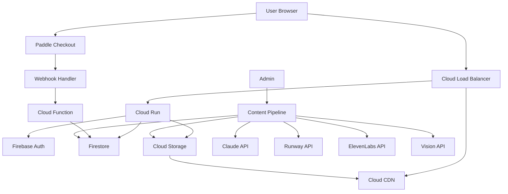

# SeeVoca - 시스템 아키텍처

> GCP 기반 서버리스 아키텍처 설계

---

## 📖 목차

1. [아키텍처 개요](#아키텍처-개요)
2. [시스템 구성도](#시스템-구성도)
3. [GCP 서비스](#gcp-서비스)
4. [데이터 플로우](#데이터-플로우)
5. [보안](#보안)
6. [확장성](#확장성)
7. [비용 최적화](#비용-최적화)

---

## 🎯 아키텍처 개요

### 설계 원칙

1. **서버리스 우선**: 관리 부담 최소화
2. **글로벌 확장**: CDN + 다중 리전
3. **비용 효율**: 프리티어 최대 활용
4. **높은 가용성**: 99.9% uptime 목표
5. **빠른 응답**: < 2초 페이지 로딩

### 기술 스택

**Frontend**
```
- Framework: Next.js 14 (App Router)
- Language: TypeScript
- Styling: Tailwind CSS
- Animation: Framer Motion
- State: Zustand (경량 상태 관리)
```

**Backend**
```
- Hosting: Cloud Run (서버리스 컨테이너)
- Functions: Cloud Functions (이벤트 처리)
- Database: Firestore (NoSQL)
- Storage: Cloud Storage + CDN
- Cache: Cloud CDN
```

**Auth & Payment**
```
- Authentication: Firebase Auth
- Payment: Paddle
- Email: SendGrid (선택)
```

**AI & Media**
```
- Story: Anthropic Claude API
- Video: Google Veo 3.1 API
- Audio: ElevenLabs API
- Vision: Google Cloud Vision API
```

---

## 🏗️ 시스템 구성도

### High-Level Architecture

```
┌─────────────────────────────────────────────────────────┐
│                     User Devices                        │
│         (Web Browser / Mobile App)                      │
└──────────────┬──────────────────────────────────────────┘
               │
               ▼
┌─────────────────────────────────────────────────────────┐
│                  Cloud CDN (Global)                     │
│              Static Assets Cache                        │
└──────────────┬──────────────────────────────────────────┘
               │
               ▼
┌─────────────────────────────────────────────────────────┐
│              Cloud Load Balancer                        │
└──────────────┬──────────────────────────────────────────┘
               │
               ├─────────────┬─────────────┬──────────────┐
               ▼             ▼             ▼              ▼
         ┌─────────┐   ┌─────────┐   ┌─────────┐   ┌─────────┐
         │Cloud Run│   │Firebase │   │ Paddle  │   │  APIs   │
         │ (Next.js│   │  Auth   │   │Billing  │   │(Claude, │
         │   SSR)  │   │         │   │         │   │ Runway) │
         └────┬────┘   └────┬────┘   └────┬────┘   └────┬────┘
              │             │             │             │
              └─────────────┴─────────────┴─────────────┘
                            │
                            ▼
                ┌───────────────────────┐
                │    Firestore (DB)     │
                │  - users              │
                │  - maps               │
                │  - stages             │
                │  - progress           │
                └───────────────────────┘
                            │
                            ▼
                ┌───────────────────────┐
                │  Cloud Storage (GCS)  │
                │  - Videos             │
                │  - Animations         │
                │  - Audio files        │
                └───────────────────────┘
```

### Detailed Components



---

## ☁️ GCP 서비스

### 1. Cloud Run (서버리스 컨테이너)

**용도**: Next.js 애플리케이션 호스팅

**설정**:
```yaml
# cloudbuild.yaml
steps:
  - name: 'gcr.io/cloud-builders/docker'
    args: ['build', '-t', 'gcr.io/$PROJECT_ID/seevoca:$SHORT_SHA', '.']
  
  - name: 'gcr.io/cloud-builders/docker'
    args: ['push', 'gcr.io/$PROJECT_ID/seevoca:$SHORT_SHA']
  
  - name: 'gcr.io/google.com/cloudsdktool/cloud-sdk'
    entrypoint: gcloud
    args:
      - 'run'
      - 'deploy'
      - 'seevoca'
      - '--image=gcr.io/$PROJECT_ID/seevoca:$SHORT_SHA'
      - '--region=asia-northeast3'
      - '--platform=managed'
      - '--allow-unauthenticated'
      - '--min-instances=0'        # MVP: 비용 절약
      - '--max-instances=10'
      - '--memory=512Mi'
      - '--cpu=1'
```

**Cold Start 방지 전략** ❄️→🔥:

**Phase 1 (MVP): 인터랙티브 로딩**
```typescript
// 비용: $0
// Cold start: ~2초

// 로딩 화면 컴포넌트
export function InteractiveLoading() {
  return (
    <div className="loading-screen">
      {/* Max 캐릭터 애니메이션 */}
      <MaxCharacter animation="bouncing" />
      
      {/* 프로그레스 바 */}
      <ProgressBar 
        messages={[
          "Max is waking up... 🐶",
          "Preparing words... 📚",
          "Loading stories... 🎬",
          "Almost ready... ⏳",
          "Let's go! 🚀"
        ]}
      />
      
      {/* 미니 게임 (선택) */}
      <MiniGame 
        type="catch-falling-letters"
        duration={2000}  // 2초
      />
    </div>
  );
}

// 애니메이션 예시
const MaxAnimations = {
  bouncing: {
    // Max가 공 튀기며 기다리기
    keyframes: '@keyframes bounce...',
    duration: '1s infinite'
  },
  running: {
    // Max가 제자리에서 뛰기
    keyframes: '@keyframes run...',
  },
  excited: {
    // Max가 신나서 점프
    keyframes: '@keyframes jump...',
  }
};
```

**Phase 2 (Growth): 하이브리드**
```yaml
# 피크 타임만 min-instances=1
# 비용: ~$10-15/월

# 스케줄러 설정 (Cloud Scheduler)
- name: warmup-morning
  schedule: "0 8 * * *"  # 매일 8AM
  target: warm-up-endpoint
  
- name: warmup-evening  
  schedule: "0 16 * * *"  # 매일 4PM
  target: warm-up-endpoint

# 시간대별 설정
07:00-09:00 → min-instances=1
16:00-20:00 → min-instances=1
나머지 시간 → min-instances=0
```

**Phase 3 (Scale): Always Warm**
```yaml
# 항상 1개 인스턴스 유지
# 비용: ~$20-30/월

min-instances: 1
max-instances: 100

장점:
- Cold start 완전 제거
- 일관된 사용자 경험
- 높은 트래픽 대응
```

**로딩 최적화 기법**:
```typescript
// 1. 코드 스플리팅
const MapView = lazy(() => import('./MapView'));
const DefenseGame = lazy(() => import('./DefenseGame'));

// 2. 프리페칭
<link rel="prefetch" href="/api/stages" />
<link rel="preload" href="/max-character.webp" as="image" />

// 3. Suspense
<Suspense fallback={<InteractiveLoading />}>
  <MapView />
</Suspense>

// 4. 점진적 로딩
// 먼저 UI 표시 → 데이터 나중 로딩
```

**특징**:
- 자동 스케일링 (0 → 10 인스턴스)
- Cold start: ~2초 (인터랙티브 로딩으로 커버)
- 비용: 요청당 과금
- 리전: asia-northeast3 (서울)

### 2. Firestore (NoSQL Database)

**용도**: 모든 애플리케이션 데이터

**Collections**:
```
firestore/
├── users/
│   └── {userId}/
│       ├── email
│       ├── displayName
│       ├── purchases
│       └── progress
│
├── maps/
│   └── {mapId}/
│       ├── name_en
│       ├── totalStages
│       └── difficulty
│
├── stages/
│   └── {stageId}/
│       ├── title_en
│       ├── videoUrl
│       └── wordIds[]
│
├── words/
│   └── {wordId}/
│       ├── word
│       ├── translation
│       └── audioUrl
│
└── gameSessions/
    └── {sessionId}/
        ├── userId
        ├── score
        └── accuracy
```

**인덱스**:
```
- users: email (ASC)
- stages: mapId (ASC), stageNumber (ASC)
- gameSessions: userId (ASC), createdAt (DESC)
```

**보안 규칙**:
```javascript
rules_version = '2';
service cloud.firestore {
  match /databases/{database}/documents {
    // Users can read/write their own data
    match /users/{userId} {
      allow read, write: if request.auth.uid == userId;
    }
    
    // Anyone can read maps, stages, words
    match /maps/{mapId} {
      allow read: if true;
      allow write: if false; // Admin only via backend
    }
    
    match /stages/{stageId} {
      allow read: if true;
      allow write: if false;
    }
    
    match /words/{wordId} {
      allow read: if true;
      allow write: if false;
    }
    
    // Users can write their own game sessions
    match /gameSessions/{sessionId} {
      allow create: if request.auth != null && 
                      request.resource.data.userId == request.auth.uid;
      allow read: if request.auth.uid == resource.data.userId;
    }
  }
}
```

### 3. Cloud Storage (파일 저장)

**Bucket 구조**:
```
seevoca-assets/
├── videos/
│   ├── map_1_stage_1/
│   │   ├── full_video_1080p.mp4    # 고화질
│   │   ├── full_video_720p.mp4     # 중화질
│   │   └── full_video_480p.mp4     # 저화질 (모바일)
│   └── map_1_stage_2/
│       └── ...
│
├── animations/
│   ├── map_1_stage_1/
│   │   ├── dog.webp
│   │   ├── hungry.webp
│   │   └── ...
│   └── map_1_stage_2/
│       └── ...
│
├── audio/
│   ├── map_1_stage_1/
│   │   ├── dog.mp3
│   │   └── ...
│   └── ...
│
└── thumbnails/
    └── map_1_stage_1.jpg
```

**비디오 가변 스트리밍 전략** 🎥 (트래픽 비용 절감):

**디바이스별 해상도 자동 선택**:
```typescript
// 사용자 환경 감지
function getOptimalVideoQuality(): VideoQuality {
  const connection = navigator.connection;
  const devicePixelRatio = window.devicePixelRatio;
  const screenWidth = window.innerWidth;
  
  // 네트워크 속도 감지
  const effectiveType = connection?.effectiveType;
  
  // 1. 네트워크 기반
  if (effectiveType === '4g') {
    return screenWidth > 1024 ? '1080p' : '720p';
  }
  if (effectiveType === '3g') {
    return '720p';
  }
  if (effectiveType === '2g' || effectiveType === 'slow-2g') {
    return '480p';
  }
  
  // 2. 화면 크기 기반
  if (screenWidth < 768) {
    return '720p';  // 모바일
  }
  if (screenWidth < 1440) {
    return '720p';  // 태블릿
  }
  return '1080p';  // 데스크톱
  
  // 3. 데이터 절약 모드 확인
  if (connection?.saveData) {
    return '480p';
  }
}

// 비디오 URL 동적 생성
function getVideoUrl(stageId: string, quality: VideoQuality): string {
  return `https://cdn.seevoca.com/videos/${stageId}/full_video_${quality}.mp4`;
}
```

**Adaptive Bitrate Streaming (HLS)** (Phase 2):
```
# 고급 스트리밍 (YouTube 방식)
videos/
└── map_1_stage_1/
    ├── manifest.m3u8           # 메인 플레이리스트
    ├── 1080p/
    │   ├── playlist.m3u8
    │   ├── segment_001.ts
    │   └── segment_002.ts
    ├── 720p/
    │   └── ...
    └── 480p/
        └── ...

장점:
- 네트워크 상황에 따라 실시간 화질 변경
- 버퍼링 최소화
- 대역폭 최적화

구현: Mux, Cloudflare Stream (유료)
```

**비용 절감 효과**:
```
기존 (1080p만):
- 파일 크기: 100MB
- 10,000 views = 1TB
- 비용: $120 (CDN)

최적화 후:
- 모바일 60%: 720p (40MB) = 240GB
- 태블릿 20%: 720p (40MB) = 80GB  
- 데스크톱 20%: 1080p (100MB) = 200GB
- 총: 520GB
- 비용: $62 (48% 절감!)
```

**비디오 인코딩 설정**:
```bash
# FFmpeg로 다중 해상도 생성
# 1080p (고화질)
ffmpeg -i input.mp4 \
  -vf scale=1920:1080 \
  -c:v libx264 -preset slow -crf 22 \
  -c:a aac -b:a 128k \
  output_1080p.mp4

# 720p (중화질)  
ffmpeg -i input.mp4 \
  -vf scale=1280:720 \
  -c:v libx264 -preset slow -crf 23 \
  -c:a aac -b:a 96k \
  output_720p.mp4

# 480p (저화질)
ffmpeg -i input.mp4 \
  -vf scale=854:480 \
  -c:v libx264 -preset slow -crf 24 \
  -c:a aac -b:a 64k \
  output_480p.mp4
```

**프리로딩 전략**:
```typescript
// 다음 비디오 미리 로딩 (백그라운드)
function preloadNextStage(currentStageId: string) {
  const nextStageId = getNextStageId(currentStageId);
  const quality = getOptimalVideoQuality();
  const videoUrl = getVideoUrl(nextStageId, quality);
  
  // 낮은 우선순위로 프리로드
  const link = document.createElement('link');
  link.rel = 'prefetch';
  link.as = 'video';
  link.href = videoUrl;
  document.head.appendChild(link);
}
```

**설정**:
```bash
# Public access
gsutil iam ch allUsers:objectViewer gs://seevoca-assets

# CORS for web
gsutil cors set cors.json gs://seevoca-assets

# Lifecycle (선택)
gsutil lifecycle set lifecycle.json gs://seevoca-assets
```

**cors.json**:
```json
[
  {
    "origin": ["https://seevoca.com"],
    "method": ["GET"],
    "responseHeader": ["Content-Type"],
    "maxAgeSeconds": 3600
  }
]
```

### 4. Cloud CDN (콘텐츠 전송)

**용도**: 전 세계 빠른 콘텐츠 전송

**설정**:
```bash
gcloud compute backend-buckets create seevoca-cdn \
    --gcs-bucket-name=seevoca-assets \
    --enable-cdn
```

**Cache 정책**:
```
비디오 (MP4): 7 days
이미지 (WebP): 30 days
오디오 (MP3): 30 days
정적 에셋: 1 year
```

### 5. Cloud Functions (이벤트 처리)

**Functions**:

**1) Paddle Webhook Handler**
```typescript
// functions/paddle-webhook/index.ts
import { onRequest } from 'firebase-functions/v2/https';
import { Paddle } from '@paddle/paddle-node-sdk';

export const paddleWebhook = onRequest(async (req, res) => {
  const paddle = new Paddle(process.env.PADDLE_API_KEY!);
  
  // Verify webhook signature (using paddle sdk or manual verification)
  // Paddle uses a signature header 'Paddle-Signature'
  const signature = req.headers['paddle-signature'] as string;
  const secret = process.env.PADDLE_WEBHOOK_SECRET!;
  
  if (paddle.webhooks.unmarshal(req.body, secret, signature)) {
      const eventData = req.body.data;
      if (req.body.event_type === 'transaction.completed') {
           // Handle transaction completion
           const userId = eventData.custom_data.userId;
           const mapId = eventData.custom_data.mapId;
           
           // Update Firestore
           await unlockMap(userId, mapId);
      }
  }
  
  res.json({ received: true });
});
```

**2) Content Generation Trigger**
```typescript
// functions/generate-content/index.ts
import { onDocumentCreated } from 'firebase-functions/v2/firestore';

export const onStageCreated = onDocumentCreated(
  'stages/{stageId}',
  async (event) => {
    const stage = event.data?.data();
    
    // Trigger content generation pipeline
    await generateStageContent(stage);
  }
);
```

### 6. Firebase Authentication

**설정**:
```typescript
// lib/firebase/config.ts
import { initializeApp } from 'firebase/app';
import { getAuth, GoogleAuthProvider } from 'firebase/auth';

const firebaseConfig = {
  apiKey: process.env.NEXT_PUBLIC_FIREBASE_API_KEY,
  authDomain: process.env.NEXT_PUBLIC_FIREBASE_AUTH_DOMAIN,
  projectId: process.env.NEXT_PUBLIC_FIREBASE_PROJECT_ID,
};

const app = initializeApp(firebaseConfig);
export const auth = getAuth(app);
export const googleProvider = new GoogleAuthProvider();
```

**지원 방식**:
- Google 로그인 (주)
- Apple 로그인 (미래)
- Email/Password (미래)

---

## 🔄 데이터 플로우

### 1. 사용자 인증

```
User clicks "Sign in with Google"
  ↓
Frontend: signInWithPopup(auth, googleProvider)
  ↓
Firebase Auth: Google OAuth 처리
  ↓
User token 생성
  ↓
Frontend: 토큰 저장 (localStorage)
  ↓
Firestore: /users/{uid} 생성 (없으면)
  ↓
Redirect to Map
```

### 2. 비디오 시청

```
User clicks Stage
  ↓
Frontend: Fetch stage data from Firestore
  ↓
Get videoUrl from stage
  ↓
<video src={videoUrl} /> 렌더링
  ↓
Cloud CDN에서 비디오 스트리밍
  ↓
User watches (Progress tracking)
  ↓
80% 완료 시 Firestore 업데이트
  ↓
Game 자동 시작
```

### 3. 결제 플로우

```
User clicks "Unlock Map"
  ↓
Frontend: Open Paddle Checkout Overlay
  ↓
User 결제 (Paddle)
  ↓
Paddle: Webhook to Cloud Function
  ↓
Cloud Function: Firestore 업데이트
  users/{uid}/purchases/{mapId} = true
  ↓
Frontend: Map unlocked (실시간 반영)
```

### 4. 콘텐츠 생성 (Admin)

```
Admin: 단어 20개 입력
  ↓
Pipeline: Claude API (스토리 생성)
  ↓
Pipeline: Runway API (비디오 생성)
  ↓
Pipeline: Vision API (단어 타임스탬프)
  ↓
Pipeline: OpenCV (애니메이션 추출)
  ↓
Pipeline: ElevenLabs (오디오 생성)
  ↓
Upload to Cloud Storage
  ↓
Update Firestore (videoUrl, animations)
  ↓
CDN cache invalidate
  ↓
Ready for users!
```

---

## 🔒 보안

### 1. 인증 & 인가

**Firebase Auth**:
```typescript
// Middleware: Auth check
export async function middleware(request: NextRequest) {
  const token = request.cookies.get('auth_token');
  
  if (!token) {
    return NextResponse.redirect('/login');
  }
  
  // Verify token
  const decodedToken = await admin.auth().verifyIdToken(token.value);
  
  // Attach user to request
  request.headers.set('x-user-id', decodedToken.uid);
  
  return NextResponse.next();
}
```

### 2. API 보안

**Rate Limiting**:
```typescript
// Cloud Run 설정
concurrency: 80
maxInstances: 10

// Code
import rateLimit from 'express-rate-limit';

const limiter = rateLimit({
  windowMs: 15 * 60 * 1000, // 15분
  max: 100 // IP당 100 requests
});

app.use('/api', limiter);
```

### 3. 환경 변수

**Secret Manager 사용**:
```bash
# Store secrets
echo -n "abc..." | gcloud secrets create paddle-api-key --data-file=-

# Access in Cloud Run
gcloud run services update seevoca \
  --update-secrets=PADDLE_API_KEY=paddle-api-key:latest
```

### 4. HTTPS Only

```yaml
# Cloud Run 강제 HTTPS
allow-unauthenticated: true
```

---

## 📈 확장성

### 1. 자동 스케일링

**Cloud Run**:
```
동시 요청: 80/instance
최소 인스턴스: 0 (비용 절약)
최대 인스턴스: 10 (초기) → 100 (성장 후)

트래픽 증가 시:
1 req → 1 instance
100 req → 2 instances
1000 req → 13 instances
```

### 2. Database 확장

**Firestore**:
- 자동 샤딩
- 무제한 확장
- 단일 문서 1MB 제한 주의

**최적화**:
```typescript
// Bad: 모든 단어 가져오기
const words = await getDocs(collection(db, 'words'));

// Good: 필요한 것만
const words = await getDocs(
  query(
    collection(db, 'words'),
    where('stageId', '==', 'map_0_stage_1')
  )
);
```

### 3. CDN Caching

```
Hit Rate 목표: > 90%

Cache-Control headers:
- Videos: max-age=604800 (7 days)
- Images: max-age=2592000 (30 days)
- Static: max-age=31536000 (1 year), immutable
```

---

## 💰 비용 최적화

### 1. 프리티어 활용

**Cloud Run**:
```
무료: 2M requests/month
예상: 10K MAU = ~300K requests/month
비용: $0
```

**Firestore**:
```
무료: 50K reads, 20K writes/day
예상: 10K MAU = ~30K reads/day
비용: $0
```

**Cloud Storage**:
```
무료: 5GB storage
예상: Map 0 (7 videos) = ~700MB
비용: $0
```

### 2. 비용 절감 전략

**이미지 최적화**:
```typescript
// WebP 사용 (30-50% 작음)
// 적절한 해상도
animations: 100x100 (not 1000x1000)
thumbnails: 400x300 (not 1920x1080)
```

**Video 최적화**:
```
Resolution: 1080p (not 4K)
Bitrate: 2-3 Mbps (충분)
Codec: H.264
```

**Firestore 읽기 최소화**:
```typescript
// Client-side caching
const cachedStages = localStorage.getItem('stages');
if (cachedStages && isRecent(cachedStages)) {
  return JSON.parse(cachedStages);
}
```

### 3. 월 비용 예측

**MVP (10K MAU)**:
```
Cloud Run: $0 (프리티어)
Firestore: $0-5
Cloud Storage: $1-2
CDN: $5-10
Total: ~$6-17/month
```

**Growth (100K MAU)**:
```
Cloud Run: $20-30
Firestore: $30-50
Cloud Storage: $10-15
CDN: $50-100
Total: ~$110-195/month
```

---

## 🛠️ 개발 환경

### Local Development

```bash
# .env.local
NEXT_PUBLIC_FIREBASE_API_KEY=xxx
NEXT_PUBLIC_FIREBASE_PROJECT_ID=xxx
STRIPE_SECRET_KEY=sk_test_xxx

# Run
npm run dev

# Firestore emulator
firebase emulators:start
```

### Staging Environment

```
Project: seevoca-staging
URL: https://staging.seevoca.com
Branch: develop
Auto-deploy: Yes
```

### Production Environment

```
Project: seevoca-prod
URL: https://seevoca.com
Branch: main
Auto-deploy: Yes (with approval)
```

---

## 📚 관련 문서

- [Database Schema](database-schema.md) - Firestore 상세 설계
- [API Design](api-design.md) - API 엔드포인트
- [Content Pipeline](content-pipeline.md) - AI 자동화
- [Module 01](../04_DEVELOPMENT/01-project-init.md) - 프로젝트 초기화

---

**Next**: [Database Schema](database-schema.md) →

*Last updated: 2025-01-19*
